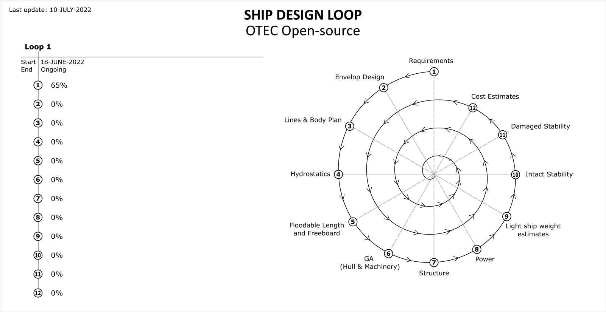

# OTEC-open-source

An open-source Ocean Thermal Energy Conversion (OTEC) project.

Hi, my name is Yev. I am looking for collaborators to work with on a marine/mechanical/civil engineering project, [OTEC](https://en.wikipedia.org/wiki/Ocean_thermal_energy_conversion) plant of an off-shore grazing type. If you are one of the following, please get in touch with me and let us self-organize to tackle the climate change and energy crisis together:

* Mechanical/Civil/Chemical/Marine engineer with some spare time
* Mechanical/Civil/Chemical/Marine engineering student wishing to contribute and learn
* Master's/Doctorate students wishing to contribute or share the expertise
* Hobbyists in the disciplines mentioned above
* Expert in heat exchangers/pumps/pipeline willing to contribute

Please contact me either [here on the discussion board](https://github.com/yev-d/OTEC-open-source/discussions/1#discussion-4121236) or via LinkedIn: https://www.linkedin.com/in/yev-d-0344855a/

If you haven't heard about the OTEC Plant or need a refresher, head over here for a brief [OTEC Plant 101](https://github.com/yev-d/OTEC-open-source/blob/faed2eac8a5f5c1297273f6227dcf2dd2ea728ff/OTEC-Plant-101.md). 

### Why Open-Source?

The open-source concept positively impacted the growth of software development. **Linus's law** asserts that "given enough eyeballs, all bugs are shallow" [[Linus's law - Wikipedia](https://en.wikipedia.org/wiki/Linus%27s_law)]. OTEC-open-source aims to develop this complex engineering project openly, in the spirit of crowdsourcing, to promote technological growth.

### Why is OTEC Plant important?

The OTEC technology can meet the global electricity demands. In [2019 the world's electricity consumption](https://www.statista.com/statistics/280704/world-power-consumption/) was 23 845 TWh, and the OTEC potential capacity is estimated at 49 000 TWh.

### Where OTEC Plant is best utilized?

OTEC Plant requires a temperature difference of 20C between the surface water and the deep sea. The best-case scenario is to pump the cold water from 1000m depth at 5C for condensing and warm surface water at 25C for evaporating the working fluid.

The global ocean temperature gradient map shows the best locations for the OTEC Plant, with temperatures above 25C.

***Ocean global temperature gradient map*** [[Source]](https://commons.wikimedia.org/wiki/File:Weeklysst.gif)

***Temperature gradient temperature vs. depth*** [[Source]](https://commons.wikimedia.org/wiki/File:THERMOCLINE.png)

### Environmental Impact

It has been demonstrated that discharging the deep ocean water in the Euphotic zone between 80m and 200m has negligible effects on the marine environment and within the natural course of a life cycle. It was further shown that the discharge of the ocean deep nutrient reach water might promote the restoration of the surface water nutrient balance, reverse coral bleaching and benefit the fishing industries by promoting the growth of the species within 1km of OTEC Plant.

***Research into environmental impact the of OTEC effect***

## Expectations

To develop a robust concept design for an offshore grazing OTEC Plant. The plant should be modular. A 500kW to 1MW capacity. To be easily integratable with other modular plants to grow the capacity. Have low capital investment. Ideally, the plant shall output electricity only. The Hydrogen, Ammonia or other byproducts shall be done in separate modules, depending on the user's needs.

The water intake depth = 800 to 1000m
The water outlet depth = 150 to 200m (to have negligible effects on the marine environment)

Below is the suggestion for the design basis.

## In brief

OTEC plants can be subdivided into the following seven technologies [[Reference: Technical Readiness of Ocean Thermal Energy Conversion (OTEC)]](https://github.com/yev-d/OTEC-open-source/blob/main/Literature%20Review/PDF/2009-11_Technical%20Readiness%20of%20Ocean%20Thermal%20Energy%20Conversion%20(OTEC)%20Nov-2009.pdf). Click on the section below to go to its discussion board.

1. [Cold water pipe](https://github.com/yev-d/OTEC-open-source/discussions/2#discussion-4123687)
2. [Heat exchangers](https://github.com/yev-d/OTEC-open-source/discussions/3#discussion-4123694)
3. [Platform-pipe interface](https://github.com/yev-d/OTEC-open-source/discussions/4#discussion-4123698)
4. [Platform](https://github.com/yev-d/OTEC-open-source/discussions/5#discussion-4123704)
5. [Power cable](https://github.com/yev-d/OTEC-open-source/discussions/6#discussion-4123707)
6. [Platform mooring system](https://github.com/yev-d/OTEC-open-source/discussions/7#discussion-4123709)
7. [Pumps and turbines](https://github.com/yev-d/OTEC-open-source/discussions/8#discussion-4123711)

In addition following categories are considered:

9. [Environment](https://github.com/yev-d/OTEC-open-source/discussions/9#discussion-4123713)
10. [Economics](https://github.com/yev-d/OTEC-open-source/discussions/10#discussion-4123714)
11. [Maritime Law & Legal aspects](https://github.com/yev-d/OTEC-open-source/discussions/11#discussion-4123715)

## Status

Status of [SHIP DESIGN Loop](Ship-design-loop/README.md).

## License

This project, its design documents, diagrams, drawings, work files, and any other files explaining the design and functionality of this project are licenced under [TAPR Open Hardware License](http://www.tapr.org/ohl.html)

OTEC-open-source project is meant to be an [**Open Source Hardware**](https://www.oshwa.org/definition/) project:

> Open-source hardware is hardware whose design is made publicly available so that anyone can study, modify, distribute, make, and sell the design or hardware based on that design.
