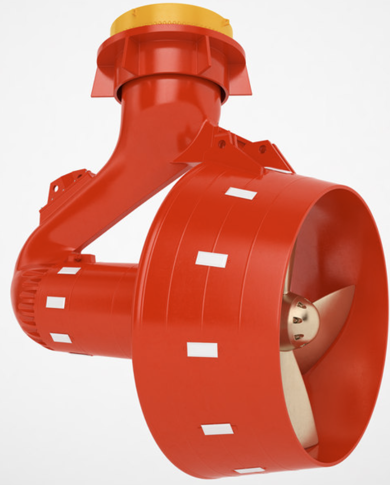

# SHIP DESIGN LOOP - Open-source OTEC plant

### Table of contents:

- [Status](#status)
- [Requirements](#requirements)
- [Envelope Design](#envelope-design)
- [Lines & Body Plan](#lines--body-plan)
- [Hydrostatics](#hydrostatics)
- [Floodable Length and Freeboard](#floodable-length-and-freeboard)
- [General Arrangement, Hull and Machinery](#general-arrangement-hull-and-machinery)
- [Structure](#structure)
- [Power](#power)
- [Light Ship weight estimates](#light-ship-weight-estimates)
- [Intact Stability](#intact-stability)
- [Damaged Stability](#damaged-stability)
- [Cost Estimates](#cost-estimates)

## Status

## Requirements

### Contributors:

### Summary

* Deck Crane
* Evaporators
* Condensers
* Turbine(s)
* Four vacuum pumps (two workings, two back-ups)
* Emergency diesel generator
* Four chain stoppers (One at each corner)
* Four SWL 50T mooring winches (each corner)
* Deck davits
* Navigation lights
* Navigation positioning antennas
* Control room
* Gas leak detectors
* Four thrusters or [Azipod](https://en.wikipedia.org/wiki/Azipod) for position stabilization

             

## Envelope Design

### Contributors:

No one yet.

### Summary

* Not started

## Lines & Body Plan

### Contributors:

No one yet.

### Summary

* Not started

## Hydrostatics

### Contributors:

No one yet.

### Summary

* Not started

## Floodable Length and Freeboard

### Contributors:

No one yet.

### Summary

* Not started

## General Arrangement, Hull and Machinery

### Contributors:

### Summary

* [ABS Rules](https://ww2.eagle.org/en/rules-and-resources/rules-and-guides.html#/content/dam/eagle/rules-and-guides/current/special_service/10_barges_2022)

## Structure

### Contributors:

No one yet.

### Summary

* Not started

## Power

### Contributors:

No one yet.

### Summary

* Not started

## Light Ship weight estimates

### Contributors:

No one yet.

### Summary

* Not started

## Intact Stability

### Contributors:

No one yet.

### Summary

* Not started

## Damaged Stability

### Contributors:

No one yet.

### Summary

* Not started

## Cost Estimates

### Contributors:

No one yet.

### Summary

* Not started
